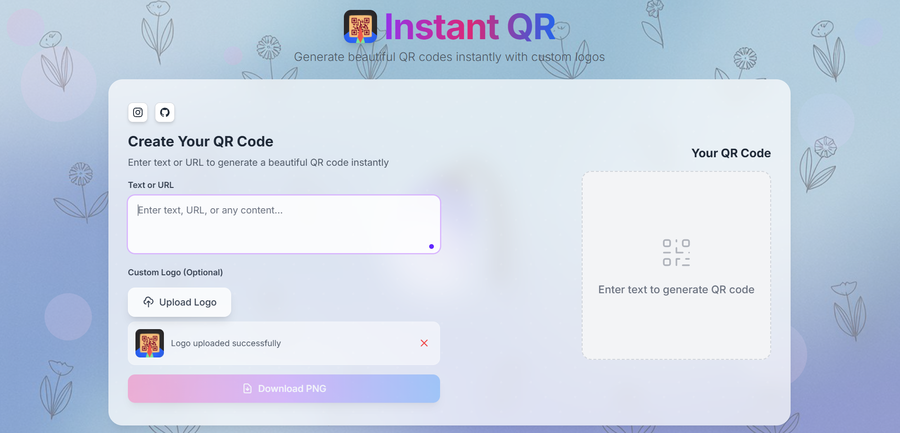
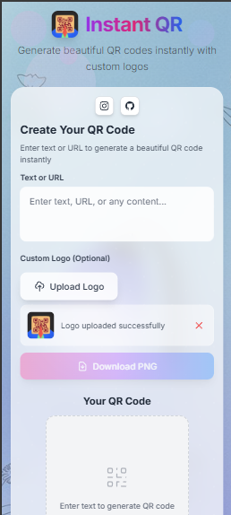

# ✨ Instant QR - Beautiful QR Code Generator

<div align="center">


**A modern, elegant QR code generator built with Next.js and Tailwind CSS**

Generate high-quality QR codes instantly with custom logos, perfect for businesses, events, and personal use.

[](https://vercel.com/new/clone?repository-url=https://github.com/Rudraa01/instant-qr)
[](https://opensource.org/licenses/MIT)
[](https://nextjs.org/)
[](https://tailwindcss.com/)

</div>

---

## 📸 Website Preview

<div align="center">

### 🖥️ Desktop View

*Clean, professional interface with side-by-side layout*

### 📱 Mobile View  

*Responsive design that works perfectly on all devices*


</div>

---

## ✨ Features

<div align="center">

| 🚀 **Real-time Generation** | 🎨 **Custom Logos** | 📱 **Responsive Design** |
|:---:|:---:|:---:|
| QR codes update instantly as you type | Add your own logo to the center | Works perfectly on all devices |

| 💾 **High Quality Downloads** | 🎭 **Beautiful UI** | ⚡ **Fast & Modern** |
|:---:|:---:|:---:|
| PNG format with no watermarks | Elegant glass morphism design | Built with Next.js 14 |

</div>

### 🌟 Key Highlights

- ✅ **Zero Configuration** - Works out of the box
- ✅ **No Watermarks** - Clean, professional QR codes  
- ✅ **Real-time Preview** - See changes instantly
- ✅ **Logo Integration** - Perfect logo positioning
- ✅ **Social Media Ready** - Instagram & GitHub integration
- ✅ **One-Screen Design** - No scrolling needed
- ✅ **Glass Morphism UI** - Modern, elegant interface
- ✅ **Custom Background** - Use your own background images

## 🚀 Tech Stack

<div align="center">

| Frontend | Styling | Tools & Deployment |
|:---:|:---:|:---:|
|  |  |  |
|  |  |  |

</div>

### 🛠️ Libraries & Dependencies

- **🖼️ QR Generation**: `react-qr-code` - High-quality QR code rendering
- **📷 Image Export**: `html2canvas` - Convert HTML to downloadable images  
- **🎨 Styling**: Custom Tailwind CSS with glass morphism effects
- **📱 Responsive**: Mobile-first design with breakpoint optimization

## 🛠️ Quick Start

<div align="center">

### ⚡ Get up and running in 3 steps

</div>

```bash
# 1️⃣ Clone the repository
git clone https://github.com/yourusername/instant-qr.git
cd instant-qr

# 2️⃣ Install dependencies  
npm install

# 3️⃣ Start development server
npm run dev
```

<div align="center">

🎉 **That's it!** Open [http://localhost:3000](http://localhost:3000) and start generating beautiful QR codes!

</div>

### 🔧 Additional Commands

```bash
# Build for production
npm run build

# Start production server
npm start

# Lint code
npm run lint
```

## � Deploy to Vercel

<div align="center">

### 🌐 One-Click Deployment

[](https://vercel.com/new/clone?repository-url=https://github.com/Rudraa01/instant-qr)

**Or follow these steps:**

</div>

### 📤 Manual Deployment

1. **📂 Push to GitHub**
   ```bash
   git add .
   git commit -m "🎉 Initial deployment"
   git push origin main
   ```

2. **🔗 Connect to Vercel**
   - Visit [vercel.com](https://vercel.com)
   - Click "New Project"
   - Import your GitHub repository
   - Vercel auto-detects Next.js settings

3. **🎯 Custom Domain (Optional)**
   - Add your domain in Vercel dashboard
   - Update URLs in `pages/index.js`

<div align="center">

### 🌟 Live Demo

**[Visit Live Demo →](https://instantqrme.vercel.app)**

</div>

## 🎨 Customization Guide

<div align="center">

### 🎭 Make it your own!

</div>

### 🌈 Colors & Theme

**Edit `tailwind.config.js`:**
```javascript
colors: {
  pastel: {
    pink: '#ffb3e6',    // 💕 Soft pink
    purple: '#e8b7ff',  // 💜 Light purple  
    blue: '#c7e9ff',    // 💙 Sky blue
    // ✨ Add your custom colors here
  }
}
```

### 🖼️ Background & Images

**Replace images in `/public/`:**
- 📸 `background.jpeg` - Main background image
- 🏷️ `logo.jpeg` - Your app logo
- 🌸 `flowers.png` - Decorative pattern (optional)

### 🔤 Typography

**Update fonts in `styles/globals.css`:**
```css
@import url('https://fonts.googleapis.com/css2?family=YourFont:wght@300;400;500;600;700;800&display=swap');
```

### 🔗 Social Media Links

**Update in `components/QRGenerator.js`:**
```javascript
// Instagram
href="https://instagram.com/_rudra.aaaaa"

// GitHub  
href="https://github.com/Rudraa01"
```

## 📱 Features in Detail

### QR Code Generation
- Supports text, URLs, contact info, WiFi credentials, and more
- High error correction level for reliable scanning
- Customizable size based on screen resolution

### Logo Integration
- Upload any image format (PNG, JPG, SVG)
- Automatic sizing and positioning
- Maintains QR code scannability

### Download Options
- High-resolution PNG export
- No watermarks or branding
- Optimized file size

## � Project Structure

<div align="center">

### 🏗️ Clean, organized codebase

</div>

```
📦 instant-qr/
├── 📄 README.md                 # You are here!
├── ⚙️ package.json              # Dependencies & scripts
├── 🎨 tailwind.config.js        # Custom design system
├── 🔧 next.config.js            # Next.js configuration
├── 📝 .env.example             # Environment variables template
├── 🚀 vercel.json              # Deployment configuration
│
├── 📱 components/               # Reusable UI components
│   ├── 🏠 Header.js            # Beautiful animated header
│   ├── 👥 Footer.js            # Social media footer  
│   └── 🔲 QRGenerator.js       # Main QR generator logic
│
├── 🌍 pages/                   # Next.js pages (router)
│   ├── 🎯 index.js             # Home page with SEO
│   └── 📋 _app.js              # App wrapper & global styles
│
├── 🎨 styles/                  # Custom styling
│   └── 🌐 globals.css          # Global CSS with Tailwind
│
└── 🖼️ public/                  # Static assets
    ├── 🏷️ logo.jpeg            # Your custom logo
    ├── 🌸 background.jpeg      # Background image
    ├── ⭐ favicon.svg          # App icon
    └── 📸 website-*.png        # Website screenshots
```

## 🌟 Contributing

<div align="center">

### 🤝 Help make Instant QR even better!

[](CONTRIBUTING.md)

</div>

### 🔄 How to Contribute

1. **🍴 Fork** the repository
2. **🌿 Create** a feature branch (`git checkout -b feature/amazing-feature`)
3. **💾 Commit** your changes (`git commit -m '✨ Add amazing feature'`)
4. **📤 Push** to the branch (`git push origin feature/amazing-feature`)
5. **🔀 Open** a Pull Request

### 💡 Ideas for Contributions

- 🎨 New themes and color schemes
- 📱 Additional QR code formats (vCard, WiFi, etc.)
- 🌍 Internationalization (i18n)
- ♿ Accessibility improvements
- 📊 Analytics integration
- 🔐 QR code encryption features

---

## 📄 License

<div align="center">


This project is open source and available under the **[MIT License](LICENSE)**.

Feel free to use, modify, and distribute! 🎉

</div>

---

## 🙏 Acknowledgments

<div align="center">

### 💖 Built with love using amazing open-source tools

</div>

- 🔥 **Next.js Team** - For the incredible React framework
- 🎨 **Tailwind CSS** - For the utility-first CSS approach  
- 📱 **react-qr-code** - For reliable QR code generation
- 🚀 **Vercel** - For seamless deployment platform
- 🎭 **Heroicons** - For beautiful SVG icons
- 🌈 **Contributors** - For making this project better

---

## 📞 Support & Contact

<div align="center">

### 🆘 Need help? We're here for you!

[](https://github.com/yourusername/instant-qr/issues)
[](https://instagram.com/your_username)
[](https://github.com/your_username)

</div>

### 💬 Get Support

- 🐛 **Bug Reports**: Open an issue on GitHub
- 💡 **Feature Requests**: Start a discussion  
- 📚 **Documentation**: Check the code comments
- 🔗 **Social**: Connect through Instagram or GitHub

---

<div align="center">

### ✨ Made with ❤️ for beautiful QR codes

**🚀 [Deploy on Vercel](https://vercel.com/new/clone?repository-url=https://github.com/yourusername/instant-qr) for the best experience!**

---

*Star ⭐ this repository if you found it helpful!*

</div>
